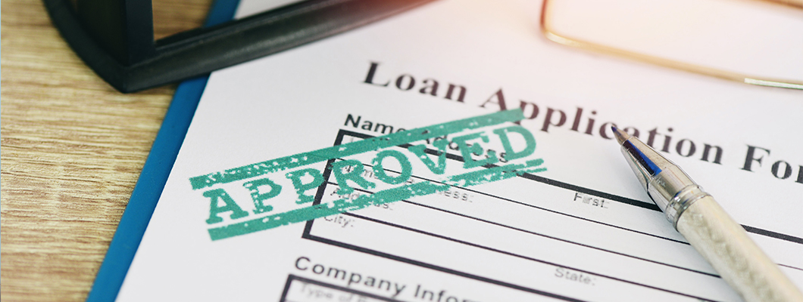

# Loan Status Prediction

In this Notebook , We are going to solve the Loan Approval Prediction.This is a Classification problem in which we need to classify whether the loan will be approved or not.

<b><h2>Table of Contents :- </h2></b>

<ul><li>Introduction</li>
<li>Business problem</li>
<li>Importing Modules</li>
<li>Dataset Analysis</li>
<li>Handling Missing Values - Categorical & Numerical</li>
<li>Outliers Detection & Handling</li>
<li>Analysis Categorical Data with Target</li>
<li>Data Preparation</li>
<li>Handling Imbalance Data</li>
<li><b>Creating Multiple Model & Choose The Ideal One</b></li>
<li>Model Building</li></ul>

<b><h2>Problem Statement :- </h2></b>

Automate the loan eligibility process (real-time) based on customer detail provided while filling the online application form. These details are Gender, Marital Status, Education, Number of Dependents, Income, Loan Amount, Credit History, and others.
 
<b>The major aim of this notebook is to predict which of the customers will have their loan approved.</b>

<b><h2>Features of our data :- </h2></b>

<ul><li>LoanID = Unique Loan ID
<li>Gender = Male/ Female</li>
<li>Married = Applicant married (Y/N)</li>
<li>Dependents = Number of dependents</li>
<li>Education = Applicant Education (Graduate/ Under Graduate)</li>
<li>SelfEmployed = Self-employed (Y/N)</li>
<li>ApplicantIncome = Applicant income</li>
<li>CoapplicantIncome = Coapplicant income</li>
<li>LoanAmount = Loan amount in thousands</li>
<li>LoanAmountTerm = Term of the loan in months</li>
<li>CreditHistory = Credit history</li>
<li>PropertyArea= Urban/ Semi-Urban/ Rural</li>
<li>LoanStatus = (Target) Loan approved (Y/N)</li></ul>

<b><h2>Skills :- </h2></b>
<ul><li>Python</li>
<li>Pandas, NumPy, Matplotlib, Seaborn</li>
<li>Model : KNeighborsClassifier, SVC, DecisionTreeClassifier, LogisticRegression, GaussianNB, RandomForestClassifier</li>
<li> Best Model Selection : LogisticRegression</li>
 <b>[ Logistic regression can be used for our model as its giving effective training testing accuracy ]</b></ul>

<b><h2>Contact :- </h2></b>
Linkedln : https://www.linkedin.com/in/vikas-vachheta/   
Email : vikasvachheta.ds@gmail.com